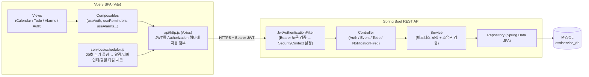
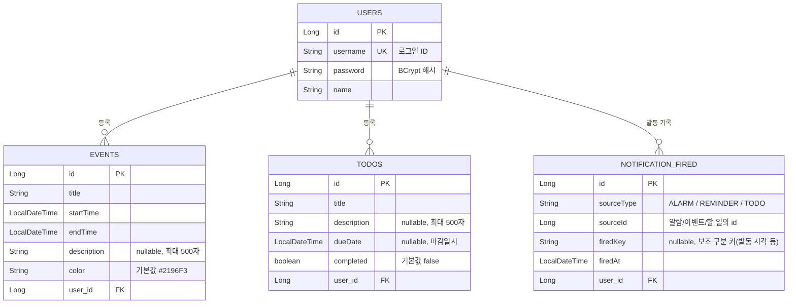
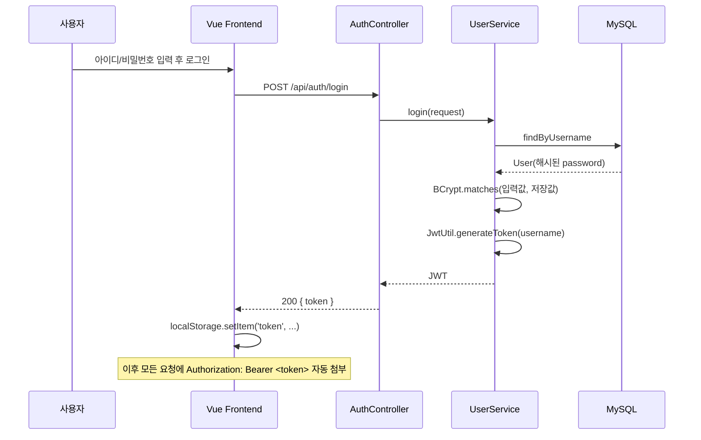

# Personal Assistant Service

캘린더 · 할 일 · 알람을 한 곳에서 관리하는 개인용 일정 관리 웹 서비스입니다.
Vue 3 SPA 프론트엔드와 Spring Boot REST API 백엔드, MySQL로 구성되어 있습니다.

## 기술 스택

| 영역 | 기술 |
| --- | --- |
| Frontend | Vue 3 (Composition API, `<script setup>`), Vue Router 4, Axios, Vite |
| Backend | Spring Boot 4.1 (Web MVC), Spring Data JPA, Spring Security, JJWT 0.12 |
| DB | MySQL 8 |
| 인증 | JWT (Bearer Token, Stateless) |

## 프로젝트 구조

```
personal-assistant-service/
├─ backend/                          # Spring Boot API 서버
│  └─ src/main/java/com/assiservice/backend/
│     ├─ entity/          # User, Event, Todo, NotificationFired (JPA 엔티티)
│     ├─ repository/      # Spring Data JPA 리포지토리
│     ├─ service/         # 비즈니스 로직 (UserService, EventService, TodoService, NotificationFiredService)
│     ├─ controller/      # REST 컨트롤러 (AuthController, EventController, TodoController, NotificationFiredController)
│     ├─ dto/             # 요청/응답 DTO
│     ├─ security/        # JwtUtil, JwtAuthenticationFilter
│     ├─ config/          # SecurityConfig (CORS, 필터체인, PasswordEncoder)
│     └─ exception/       # GlobalExceptionHandler
│
└─ frontend/                         # Vue 3 SPA
   └─ src/
      ├─ views/            # HomeView, LoginView, SignupView, calendar/, todo/, alarms/
      ├─ api/              # http(axios 인스턴스), auth.js, calendar.js, todo.js, notifications.js
      ├─ composables/      # useAuth, useReminders, useAlarms, useTodoNotifications, useNotificationFired, useToast
      ├─ services/         # scheduler.js(주기적 알림 체크), notification.js(브라우저 알림)
      ├─ router/           # vue-router 라우트 정의 + 인증 가드
      └─ utils/            # date.js, jwt.js
```

## 아키텍처 개요



- **인증 방식**: 세션을 사용하지 않는 Stateless 구조. 로그인 성공 시 서버가 JWT를 발급하고, 프론트엔드는 이를 `localStorage`에 저장한 뒤 모든 API 요청의 `Authorization: Bearer <token>` 헤더에 자동으로 실어 보냅니다(`frontend/src/api/http.js`).
- **인가(권한) 처리**: 컨트롤러 진입 전 `JwtAuthenticationFilter`가 토큰을 검증해 `Authentication`(username)을 `SecurityContext`에 세팅합니다. `Event`/`Todo` 관련 서비스는 리소스 소유자(`user_id`)와 요청자가 일치하는지 매번 검증합니다.
- **클라이언트 스케줄러**: 로그인 상태에서 20초마다 알람 시간, 캘린더 이벤트 리마인더, 할 일 마감 여부를 확인해 브라우저 알림 + 인앱 토스트를 띄웁니다(`frontend/src/services/scheduler.js`). 알람 목록/리마인더 분(分) 설정 같은 "설정값"은 서버에 저장하지 않고 사용자별로 `localStorage`에 보관하지만, "언제 알림을 이미 보냈는지"(중복 발동 방지용 발동 기록)는 `useNotificationFired` 컴포저블을 통해 `notification_fired` 테이블에 저장되어 기기를 바꿔도 중복 알림이 뜨지 않습니다.

## DB 엔티티 설계 (ERD)



> `ddl-auto=update` 설정으로 애플리케이션 기동 시 Hibernate가 엔티티 정의를 기준으로 테이블 스키마를 자동 반영합니다.

### 엔티티 관계 요약

- `User 1 : N Event`, `User 1 : N Todo`, `User 1 : N NotificationFired` — 모든 일정/할 일/발동 기록은 반드시 소유자(`user_id`, `FetchType.LAZY`)를 가집니다.
- `Event`와 `Todo`는 서로 직접적인 FK 관계가 없는 **독립 테이블**입니다. 캘린더 화면에서는 두 테이블을 각각 조회한 뒤, 프론트엔드에서 `dueDate`(Todo)를 날짜 키 기준으로 `startTime`(Event)과 병합해 하나의 달력 UI에 표시합니다(아래 "캘린더 ↔ 할 일 연동" 참고).
- `NotificationFired`도 `Event`/`Todo`/알람과 FK로 직접 연결되지 않고 `sourceType`(`ALARM`/`REMINDER`/`TODO`) + `sourceId`(해당 리소스의 id)로만 느슨하게 참조합니다. `(user_id, sourceType, sourceId, firedKey)` 조합에 유니크 제약이 걸려 있어 같은 알림이 중복 저장되지 않습니다.

## 인증 흐름



이후 요청은 `JwtAuthenticationFilter`가 토큰을 검증하여 `username`을 인증 주체로 설정하고, 각 서비스는 `Authentication.getName()`으로 현재 사용자를 조회합니다.

## REST API 명세

Base URL: `/api` (axios `baseURL: '/api'`, 상대 경로). `SecurityConfig`의 CORS 설정에 개발 origin(`http://localhost:5173`)과 배포 도메인이 등록되어 있으며, 배포 환경에서는 리버스 프록시가 `/api`를 백엔드로 라우팅합니다. 로컬에서 프론트/백엔드를 분리 실행할 때는 별도의 프록시 설정 또는 origin 조정이 필요합니다.

### 인증 (`/api/auth`) — 인증 불필요

| Method | Path | 설명 | 요청 Body | 응답 |
| --- | --- | --- | --- | --- |
| GET | `/auth/check-username` | 아이디 중복 확인 (`?username=`) | - | `{ available: boolean }` |
| POST | `/auth/signup` | 회원가입 | `{ username, password, name }` | `201 Created` |
| POST | `/auth/login` | 로그인 | `{ username, password }` | `{ token }` |

### 캘린더 이벤트 (`/api/events`) — 인증 필요

| Method | Path | 설명 | 요청 | 응답 |
| --- | --- | --- | --- | --- |
| GET | `/events?start=&end=` | 기간 내 이벤트 조회 (`startTime` 기준) | - | `200` `EventResponse[]` |
| POST | `/events` | 이벤트 생성 | `EventRequest` | `200` `EventResponse` |
| PUT | `/events/{id}` | 이벤트 수정 (소유자만) | `EventRequest` | `200` `EventResponse` |
| DELETE | `/events/{id}` | 이벤트 삭제 (소유자만) | - | `200` (본문 없음) |

`EventRequest` / `EventResponse`: `title, startTime, endTime, description, color`

### 할 일 (`/api/todos`) — 인증 필요

| Method | Path | 설명 | 요청 | 응답 |
| --- | --- | --- | --- | --- |
| GET | `/todos` | 전체 할 일 조회 (미완료 우선, 마감일 순) | - | `200` `TodoResponse[]` |
| GET | `/todos/range?start=&end=` | 기간 내 마감일(`dueDate`)을 가진 할 일 조회 — **캘린더 연동용** | - | `200` `TodoResponse[]` |
| POST | `/todos` | 할 일 생성 | `TodoRequest` | `200` `TodoResponse` |
| PUT | `/todos/{id}` | 할 일 수정 (소유자만) | `TodoRequest` | `200` `TodoResponse` |
| PATCH | `/todos/{id}/complete` | 완료 상태 토글 | `{ completed: boolean }` | `200` `TodoResponse` |
| DELETE | `/todos/{id}` | 할 일 삭제 (소유자만) | - | `200` (본문 없음) |

`TodoRequest`: `title, description, dueDate` / `TodoResponse`: `id, title, description, dueDate, completed`

### 알림 발동 기록 (`/api/notifications/fired`) — 인증 필요

알람/리마인더/할 일 마감 알림을 중복으로 띄우지 않기 위한 발동(fired) 기록 API입니다. 알람 목록이나 리마인더 분(分) 설정 같은 "설정값"은 여전히 프론트엔드 `localStorage`에 저장되며, 이 API는 "이미 알림을 보냈는지"만 서버에 저장합니다.

| Method | Path | 설명 | 요청 | 응답 |
| --- | --- | --- | --- | --- |
| GET | `/notifications/fired` | 로그인한 사용자의 발동 기록 전체 조회 | - | `200` `NotificationFiredResponse[]` |
| POST | `/notifications/fired` | 발동 기록 저장 (동일 조합 재요청 시 멱등, 중복 저장 안 됨) | `{ sourceType, sourceId, firedKey }` | `200` `NotificationFiredResponse` |
| DELETE | `/notifications/fired?sourceType=&sourceId=&firedKey=` | 발동 기록 삭제 (예: 완료 취소한 할 일을 다시 알림 대상으로) | - | `200` (본문 없음) |

`NotificationFiredRequest`: `sourceType`(`ALARM`/`REMINDER`/`TODO`), `sourceId`(알람/이벤트/할 일 id), `firedKey`(보조 구분 키 — 알람은 `요일_시간`, 리마인더는 알림 시각 ISO 문자열, 할 일은 id 문자열) / `NotificationFiredResponse`: `id, sourceType, sourceId, firedKey, firedAt`

프론트엔드에서는 `composables/useNotificationFired.js`가 로그인 시 전체 발동 기록을 한 번 캐시해두고, `useAlarms`/`useReminders`/`useTodoNotifications`가 각각 이 캐시를 통해 중복 알림 여부를 판단·기록합니다.

모든 인증 필요 엔드포인트는 `Authorization: Bearer <JWT>` 헤더가 없거나 유효하지 않으면 `401`을 반환하며, 프론트엔드 axios 인터셉터가 이를 감지해 자동 로그아웃 후 로그인 페이지로 이동시킵니다(`frontend/src/api/http.js`).

## 캘린더 ↔ 할 일 연동

Todo는 `startTime`/`endTime` 범위 대신 단일 `dueDate`(마감일시)만 가지며, Event 테이블과 FK로 직접 연결되어 있지 않습니다. 대신 캘린더 화면(`CalendarView.vue`)이 월 단위로 두 리소스를 각각 조회해 화면에서 병합합니다.

1. 월 이동 시 `GET /events?start=&end=`와 `GET /todos/range?start=&end=`를 동시에 호출.
2. Event는 `startTime`, Todo는 `dueDate`를 기준으로 날짜별 맵(`eventsByDate`)에 `itemType: 'event' | 'todo'`를 태깅해 병합.
3. `MonthCalendar`는 이벤트(분홍 점)와 할 일(초록 점)을 날짜 셀에 구분 표시하고, `DayEventList`는 할 일 항목에 "할 일" 배지를 붙여 렌더링.
4. 할 일 항목 클릭 시 완료 상태 토글(`PATCH /todos/{id}/complete`), 삭제 시 `DELETE /todos/{id}` 호출 — 이벤트 수정 모달(`EventModal`)로는 열리지 않도록 분리.

## 프론트엔드 라우트

| Path | 화면 | 인증 필요 |
| --- | --- | --- |
| `/` | HomeView | ✕ |
| `/login`, `/signup` | 로그인 / 회원가입 | ✕ |
| `/calendar` | 월간 캘린더 (Event + Todo 마감일 병합 표시) | ✓ |
| `/todo` | 할 일 목록/등록 | ✓ |
| `/alarms` | 반복/일회성 알람 관리 (로컬 저장) | ✓ |

`router/index.js`의 전역 가드가 `meta.requiresAuth`를 확인해 미인증 사용자를 `/login`으로 리다이렉트합니다.

## 로컬 실행 방법

### 사전 준비
- JDK 17, Maven(또는 wrapper), Node.js, MySQL 8
- MySQL에 `assiservice_db` 데이터베이스 생성

### 백엔드
```bash
cd backend
# DB_PASSWORD 환경변수에 MySQL root 비밀번호 설정 후 실행
./mvnw spring-boot:run
```
- 설정 파일: `backend/src/main/resources/application.properties` (DB 접속 정보, `jwt.secret`, `jwt.expiration`)
- 기본 포트: `8080`

### 프론트엔드
```bash
cd frontend
npm install
npm run dev
```
- 기본 포트: `5173`

### 시연화면

시작 페이지


메인 화면


캘린더 화면 / 할 일 연결


브라우저 별로 알람 기능 이용 가능


할 일 등 화면


Notification


